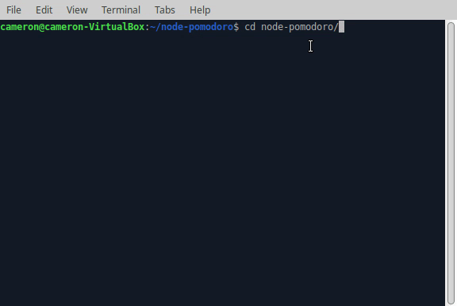

# Node Pomodoro

A Node.js application for programmers to track their work and break time.

## Why Build This?

I often lose track of time while I'm coding -- I'll start on a feature first thing in the morning, and the next time I look at the clock my stomach is growling because it's lunch-time. I built this low-profile timer to help hold myself accountable for work and break cycles.

## Techonologies Used

- Node.js (v18 or higher!)
- That's it!

## Preview



## Development

### System Requirements
- Node.js (v18 or higher!)
- NPM

### Getting Started
1. Clone the repository.
```
git clone https://github.com/cam-peck/node-pomodoro.git
cd node-pomodoro
```

2. Install all dependencies with NPM.
```
npm install
```

3. Make any needed changes to cycle times in src/pomo-config.ts with your preferred editor. Here, I'm using nano.
```
cd src
nano pomo-config.ts
```

4. Build the project.
```
npm run build
```

5. Build the project.
```
npm run start
```

## Troubleshooting

1. Not building correctly? Double check that you have Node v18 or higher installed.

```
node -v
```

2. Not getting notifications? Check out the link(s) below to ensure you have a supported notification manager.

- NPM Node Notifier --> https://www.npmjs.com/package/node-notifier
- Flow Chart --> https://github.com/mikaelbr/node-notifier/blob/HEAD/DECISION_FLOW.md

3. Have other issues? Email me via `cameronpeck317@gmail.com` with your error message and I'll check it out. Thanks for using Node Pomodoro!